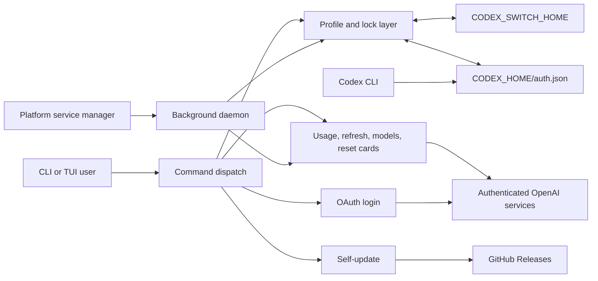

# Architecture overview

`codex-switch-global-pace` is a single Rust binary. It owns saved profile state under `CODEX_SWITCH_HOME` and coordinates access to the live Codex authentication file under `CODEX_HOME`.

## System boundaries

The application treats local files, command-line input, supported environment configuration, OAuth callbacks, HTTP responses, and release assets as trust boundaries. Production OpenAI service and GitHub API origins are fixed in the binary; endpoint environment variables are compiled only into unit-test builds or debug builds with the `test-endpoints` feature for isolated mock-server tests, and optimized builds reject that feature. A test override creates a sparse endpoint context: every service the test contacts must be set explicitly, and a missing or invalid endpoint fails before a request instead of falling back to production. Internal module calls rely on Rust types and established invariants.

## Startup and command dispatch

[`src/main.rs`](https://github.com/chriskooCK/codex-switch-global-pace/blob/dev/src/main.rs) is the thin binary entry point. [`src/app.rs`](https://github.com/chriskooCK/codex-switch-global-pace/blob/dev/src/app.rs) parses the CLI, initializes configuration and logging, chooses human or JSON output behavior, performs interactive live-auth change detection where appropriate, and dispatches to focused command modules under [`src/commands/`](https://github.com/chriskooCK/codex-switch-global-pace/tree/dev/src/commands).

Configuration is loaded once from `config.toml`. An existing unreadable or invalid file fails fast with its path; missing configuration uses defaults. CLI proxy configuration has higher priority than file and environment configuration.

The bare TUI launches profile enumeration on the blocking pool, paints its first
frame without waiting for it, and starts live-auth reconciliation, cache
loading, HTTP-client construction, file-log arming, and pending self-update
cleanup through tracked work that cannot delay that frame. Every task retains
its normal failure reporting. Once reconciliation has settled and authoritative
account refresh is ready, a cache snapshot that is still waiting for its lock is
cancelled at the lock worker's atomic acquisition boundary; an already acquired
identity-bound snapshot still finishes and is validated normally. Ordinary CLI
file logging is also demand-driven: a command that emits no enabled log record
does no log-path or ACL work.

## Authentication and profile ownership

[`src/auth.rs`](https://github.com/chriskooCK/codex-switch-global-pace/blob/dev/src/auth.rs) resolves `CODEX_HOME`, validates the Codex credential-store contract, reads and atomically writes authentication JSON, rotates live-auth backups, and builds network clients. For an existing live credential, the replacement candidate, independent original backup, and recovery record are prepared privately and flushed concurrently; all three must become durable and the live token must still match before the recovery record or replacement is published. It does not own profile selection.

On Windows, private-directory validation holds non-delete-shared handles for the
complete path and compares the protected DACL by meaning rather than ACE order.
An already exact current-user/System/Administrators policy is read-only; actual
permission drift retains recursive repair so permissions inherited by existing
children are corrected, and the repaired DACL is checked again on the same
pinned directory object.

[`src/profile.rs`](https://github.com/chriskooCK/codex-switch-global-pace/blob/dev/src/profile.rs) owns aliases, identity deduplication, imports, recoverable deletion, current-profile tracking, and switching. `auth.lock` serializes replacement or synchronization of the live `auth.json`. A compatibility-only `launch.lock` is acquired first so an older `codex-switch` process sharing the same state directory cannot restore staged credentials over a newer switch; this binary does not implement the `launch` command.

Credential replacement requires an exact `account_id` and email match; an
email-only or otherwise incomplete identity never authorizes an overwrite.
Interactive re-login captures that strict identity under a short profile
lease, releases the lease during the browser or device-code wait, and validates
the initial, current, and incoming identities after reacquiring it for commit.
Interactive overwrite confirmation follows the same ownership shape: the
prepared target and live snapshots cross the lease-free stdin wait, then a new
lease and the auth transaction revalidate them before any switch or reset-card
side effect.
The common unchanged live-auth path checks only the current marker and that
profile before avoiding a full registry scan; concurrent marker movement causes
a bounded fresh observation rather than publishing stale state.
Imports are intentionally create-only: Usage API access proves workspace
membership, but a Team workspace ID can belong to several users and cannot
authorize overwriting an existing profile. Tokens refreshed while a profile is
active are written to both the saved profile and the live auth file under the
same switching discipline. A rotated import that loses verifiable identity is
written under `recovery/`, outside the selectable profile tree.

## Usage, refresh, and selection

The [`src/usage/`](https://github.com/chriskooCK/codex-switch-global-pace/tree/dev/src/usage) module is split by responsibility:

| Module | Responsibility |
|---|---|
| `api.rs` | Authenticated requests, token refresh, retries, and import validation |
| `global_pace.rs` | Aggregate comparable weekly windows into the Global Weekly Pace summary |
| `parse.rs` | Convert service responses into stable quota structures |
| `reset_credits.rs` | Select and consume reset cards |
| `scoring.rs` | Pure eligibility, pace, and candidate scoring functions |
| `mod.rs` | Shared domain types and public module surface |

[`src/cache.rs`](https://github.com/chriskooCK/codex-switch-global-pace/blob/dev/src/cache.rs) persists usage, workspace metadata, selection history, and rejected-credential verdicts. Usage belongs to a profile alias plus its verified account ID and email; batch readers obtain one identity-checked snapshot, and deferred enrichment uses an exact revision or raw-generation compare-and-swap so it cannot overwrite a newer quota result or cross an alias rebind. Alias-scoped mutation tombstones distinguish a genuinely unchanged absence from create-then-delete ABA. Automatic selection can reuse a fresh quota-only generation, but ordinary usage readers require the complete metadata marker; only quota-only candidates need reset-card enrichment, while a fresh complete entry avoids that extra request and any approved redemption is still forcibly revalidated. CAS conflicts return the newer same-account value unchanged and selection is scored again from that authoritative result. Workspace names and confirmed absence are keyed by account ID and both remain fresh for one day; lookup releases its network slot before the cache lock and publication step. A permanently refused credential is remembered only until that exact credential is replaced. `--force` bypasses the negative results, and is the only thing that does: the daemon's periodic refresh takes current usage numbers but leaves a recorded refusal standing, since re-presenting a spent credential on a timer cannot produce a different answer. Cache file updates acquire the path-specific cross-process lock before process-wide serialization, then replace the file atomically, so an external owner cannot make unrelated state directories inherit its wait. Selection history is non-authoritative metadata: after a profile switch is durably committed, it tries that cache lock once and surfaces contention as a non-fatal warning instead of extending the switch.

Selection has two phases. Eligibility excludes candidates with missing authoritative quota data, exhausted windows, critical weekly state with a distant reset, or an unsafe Free-plan balance. Scoring then combines tier preference, pace-aware headroom, weekly sustainability, expiring quota value, and recency. The shared scoring path is used by both interactive commands and the daemon.

## TUI and output contracts

[`src/tui/`](https://github.com/chriskooCK/codex-switch-global-pace/tree/dev/src/tui) separates application state, key bindings, menus, popups, and rendering. Network or filesystem actions suspend or update the terminal deliberately rather than running inside rendering functions. Startup prioritizes selected and active accounts, publishes core quota immediately, and starts each workspace lookup only after that alias's credential persistence and lease release; an unrelated slow quota request or a superseded cache-lock wait does not hold back ready authoritative refresh, workspace metadata, or selected-account model discovery. Reset-card metadata remains deferred without hiding the quota result, and a real startup cache read error is reported without suppressing the independent network refresh. An interactive switch can cancel a usage request while it is waiting for capacity, sending a read-only GET, reading its body, or backing off, then resumes the merged refresh intent once after the switch; a token-refresh POST and replacement-token persistence remain an irreversible drained phase. Workspace reads release their profile lease before the read-only HTTP phase, and reset-card, model-discovery, token-refresh, usage, and warmup requests acquire the same process-local limit only around each HTTP operation. Retry delays and local cache or credential persistence do not retain that slot. Switch progress is derived from the tracked prepare, live-sync, and commit task rather than a transient timer; after durable commit, failure to publish auxiliary selection history is shown as a warning without leaving the switch in progress. The event loop polls work independently but redraws only for state, input, resize, switch-phase, or second-boundary changes.

Warmup releases the alias lease during a network model-list lookup. Before the
first quota-activating POST, it reacquires the lease and rechecks the strict
identity, exact credential snapshot, and token freshness; an invalidated lookup
is neither published to the model cache nor used for a request. Model results
and duplicate-fetch locks use the strict account binding plus the normalized
quota-pool set rather than the mutable alias. TUI cancellation can therefore
stop the read-only lookup or lease reacquisition, with one atomic commit before
cache publication and quota mutation. The cache retains pool-to-model mappings;
an explicit unsupported-model response invalidates them and triggers at most
one official re-resolution while preserving already completed pool targets.

[`src/output.rs`](https://github.com/chriskooCK/codex-switch-global-pace/blob/dev/src/output.rs) owns JSON response types and human formatting. In JSON mode stdout must contain only structured output; human diagnostics and progress are routed to stderr. This separation is part of the automation contract and is covered by integration tests.

## Daemon lifecycle

[`src/daemon/`](https://github.com/chriskooCK/codex-switch-global-pace/tree/dev/src/daemon) separates orchestration, polling, process detection, notifications, PID-file ownership, service-manager integration, and persisted state.

The loop uses independent timers for account polling, cache refresh, and token checks. Recoverable failures are exposed through state and bounded backoff. A pending switch is retained while an interactive Codex session is detected and retried later. Before a daemon parent spawns a child or a foreground daemon publishes PID readiness, file logging validates its secure directory, lock file, and current daily append handle. The foreground process then keeps the exact PID generation it published; graceful-stop polling reads only the mutable generation-bound request file rather than reopening the immutable PID identity on every tick.

Service managers start the binary in foreground mode:

| Platform | Integration |
|---|---|
| macOS | `~/Library/LaunchAgents/com.codex-switch-global-pace.daemon.plist` |
| Linux | `~/.config/systemd/user/codex-switch-global-pace-daemon.service` |
| Windows | `codex-switch-global-pace-daemon` Task Scheduler task |

Windows service inspection queries that exact scheduled-task name and requests
HRESULT exit semantics. Only the file-not-found HRESULT represents an absent
task; every other query failure remains an error instead of being inferred from
localized text or a broad task listing.

PID-file cleanup verifies lock ownership before removal. Removing a path while another daemon holds the underlying file lock would create two apparent owners and is forbidden.

## State layout

| Location | Owner and purpose |
|---|---|
| `$CODEX_HOME/auth.json` | Live authentication read by Codex CLI |
| `$CODEX_HOME/config.toml` | Codex configuration, including file-store requirement |
| `$CODEX_SWITCH_HOME/profiles/<alias>/auth.json` | Saved account credentials |
| `$CODEX_SWITCH_HOME/current` | Current alias marker |
| `$CODEX_SWITCH_HOME/deleted-profiles/` | Recoverable profile archives |
| `$CODEX_SWITCH_HOME/cache.json` | Usage, workspace metadata, and rejected-credential cache |
| `$CODEX_SWITCH_HOME/config.toml` | Application configuration |
| `$CODEX_SWITCH_HOME/daemon-state.json` | Daemon status and pending-switch snapshot |
| `$CODEX_SWITCH_HOME/logs/` | Rotated diagnostic logs |
| `$CODEX_SWITCH_HOME/*.lock` | Cross-process coordination files |

The defaults are `~/.codex` and `~/.codex-switch`. `CODEX_SWITCH_HOME` never changes where Codex reads its live authentication.

## Release architecture

The branch CI workflow runs tests, Clippy, and debug builds on Linux, macOS, and Windows. Linux also checks formatting, dependency advisories, and shell syntax; Windows parses the PowerShell installer.

Release artifacts are built only by GitHub Actions for six platform/architecture pairs. The workflow injects the tag-derived version, produces archives and checksums, verifies every checksum, and generates a Sigstore build-provenance bundle for the archives before creating the GitHub Release. Direct self-update verifies that bundle against this repository, the release workflow, and the exact tag ref before replacing the binary. Local release builds are diagnostic only and are never the distribution source of truth.

## Next steps

- Set up the repository with [Developer onboarding](Developer-Onboarding.md).
- Review test and pull-request requirements in [Contributing](Contributing.md).
